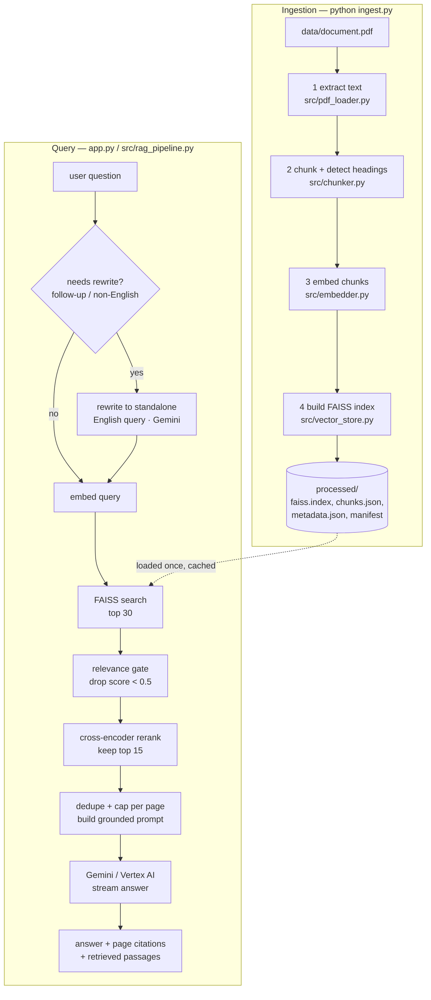

# Indian Constitution Assistant

A retrieval-augmented generation (RAG) application that answers questions about a
large corpus of Indian legal text (the Constitution of India and allied bare
Acts). Every answer is grounded **only** in the source PDF, carries page
citations, and streams token-by-token. Questions can be asked in English or
Hindi.

- **Retrieval** — `BAAI/bge-*` sentence embeddings in a FAISS index, filtered by a
  similarity threshold, then re-ordered by a cross-encoder reranker.
- **Generation** — Gemini on Google Vertex AI, constrained by a strict prompt to
  use only the retrieved context.
- **Interface** — a Streamlit chat app with native theming, plus a CLI and a
  Python API.

---

## Table of contents

- [What you get](#what-you-get)
- [Working flow (how it works)](#working-flow-how-it-works)
  - [Phase 1 — Ingestion (offline, one-off)](#phase-1--ingestion-offline-one-off)
  - [Phase 2 — Query (per question)](#phase-2--query-per-question)
  - [Data shapes](#data-shapes)
- [Project structure](#project-structure)
- [Running flow (how to run it)](#running-flow-how-to-run-it)
  - [0. Prerequisites](#0-prerequisites)
  - [1. Install](#1-install)
  - [2. Configure](#2-configure)
  - [3. Build the index](#3-build-the-index)
  - [4. Run the app](#4-run-the-app)
  - [5. Other entry points](#5-other-entry-points)
- [Configuration reference](#configuration-reference)
- [Development](#development)
- [Evaluation](#evaluation)
- [Tracing and logs](#tracing-and-logs)
- [Performance notes](#performance-notes)
- [Troubleshooting](#troubleshooting)
- [Limitations](#limitations)

---

## What you get

| Capability | Detail |
|---|---|
| Grounded answers | The model is instructed to answer only from retrieved context; if nothing relevant is found it replies "The document does not contain this information." |
| Page citations | Every answer cites page numbers; the UI also lists the exact retrieved passages. |
| Bilingual | Ask in English or Hindi. Non-English questions are rewritten to an English search query before retrieval; the answer comes back in the language you chose. |
| Reranked retrieval | A cross-encoder re-scores the top candidates for precision. |
| Relevance gate | Off-topic questions retrieve nothing instead of forcing a hallucinated answer. |
| Streaming | Real token streaming from Vertex, not a simulated typewriter. |
| Deterministic | `temperature=0` and thinking disabled by default — the same question yields the same answer. |
| Reproducible ingestion | One command builds the whole index; a manifest records which models/settings produced it. |
| Tested + linted + CI | 36 pytest cases, `ruff`, pre-commit hooks, GitHub Actions. |
| Evaluatable | A gold question set and a harness that scores retrieval hit@k / MRR. |

---

## Working flow (how it works)

The system has two independent pipelines. **Ingestion** turns the PDF into a
searchable index and runs once (or whenever the source document changes).
**Query** runs for every question the user asks.



### Phase 1 — Ingestion (offline, one-off)

Run by `ingest.py`, which chains four stages and refuses to continue if a stage
does not produce its expected output. Artifacts land in `processed/`
(git-ignored).

| # | Stage | Module | What happens | Key settings |
|---|---|---|---|---|
| 1 | **extract** | `src/pdf_loader.py` + `src/text_cleaner.py` | Opens the PDF with PyMuPDF, pulls the text of every page, collapses whitespace and strips null bytes. Output: `processed/extracted_pages.json` (`[{page_number, text}]`). | `PDF_PATH` |
| 2 | **chunk** | `src/chunker.py` | Splits each page with LangChain's `RecursiveCharacterTextSplitter` (1200 chars, 200 overlap). Drops empty and byte-identical chunks. Detects `Section N. Title`, `Article N`, `PART/CHAPTER <roman>` headings in the collapsed text and tags each chunk with `heading`, `heading_id`, `heading_kind`. Assigns a stable `chunk_id = sha256(page + text)[:24]`. Output: `processed/chunks.json`. | `chunk_size`, `chunk_overlap` in `src/chunker.py` |
| 3 | **embed** | `src/embedder.py` + `src/embedding_model.py` | Encodes each chunk's text with a SentenceTransformer (`EMBEDDING_MODEL`, default `BAAI/bge-large-en-v1.5`), L2-normalised. Incremental and checkpointed: an `embedding_cache.json` tracks which `chunk_id`s are done, so an interrupted run resumes. Output: `processed/embeddings.npy` + `processed/metadata.json`. | `EMBEDDING_MODEL`, `EMBED_BATCH_SIZE`, `EMBED_BACKEND` |
| 4 | **index** | `src/vector_store.py` | Loads `embeddings.npy`, normalises, adds them to a FAISS `IndexFlatIP` (exact inner-product = cosine on normalised vectors). Writes `processed/faiss.index` and `processed/index_stats.json`. | — |
| — | **manifest** | `ingest.py` | After a full run, writes `processed/ingest_manifest.json`: timestamp, git SHA, embedding model, reranker model, chunk params, vector count, embedding dimension. The retriever reads this on startup and warns loudly if the index was built with a different embedding model than it is configured to use. | — |

`ingest.py` flags:

| Flag | Effect |
|---|---|
| *(none)* | run all four stages in order |
| `--skip-existing` | skip a stage whose output file already exists |
| `--force` | delete every derived artifact first, then rebuild from the PDF (**required when you change `EMBEDDING_MODEL`** — vector dimensions differ) |
| `--only {pdf,chunk,embed,index}` | run a single stage |

### Phase 2 — Query (per question)

Orchestrated by `src/rag_pipeline.py`. The Streamlit app splits it in two so it
can stream: `retrieve_and_build()` does everything up to the prompt, then the app
streams generation itself. `RAGPipeline.ask()` is the non-streaming wrapper used
by the CLI, tests, and eval.

| # | Step | Module | What happens |
|---|---|---|---|
| 1 | **Query rewrite** (conditional) | `src/rag_pipeline.py` → `src/llm_service.py` | `_needs_query_rewrite()` decides whether to spend an extra Gemini call turning the question into a standalone English search query. It fires when there is conversation history, the question contains non-ASCII characters (e.g. Hindi), or it is a reference-led opener ("what about that clause?"). `QUERY_REWRITE=always\|never` overrides the heuristic. |
| 2 | **Query embedding** | `src/retriever.py` | The search query is encoded with the same model the index was built with, L2-normalised. |
| 3 | **Vector search** | `src/vector_store.py` | FAISS returns the top `RERANK_CANDIDATES` (default 30) chunk ids + cosine scores. |
| 4 | **Relevance gate** | `src/retriever.py` | Chunks scoring below `RETRIEVAL_MIN_SCORE` (default 0.5) are dropped. If nothing survives, the pipeline short-circuits and returns "The document does not contain this information." — no LLM call. |
| 5 | **Rerank** | `src/retriever.py` | A cross-encoder (`RERANK_MODEL`, default `cross-encoder/ms-marco-MiniLM-L-6-v2`) scores each `(query, chunk)` pair; results are re-sorted by that score and truncated to `top_k` (15). Set `RERANK=false` to skip. |
| 6 | **Context assembly** | `src/context_builder.py` | Chunks are ordered by rerank score, then de-duplicated: exact duplicates and near-duplicates (token-set Jaccard ≥ 0.9) are removed, and no more than `max_per_page` (3) chunks come from the same page, so the context spans more of the document. Chunks are concatenated as `[PAGE n] …` until the `max_context_chars` (12 000) budget is hit. A strict system prompt wraps them in `<document_context>` fences with instructions to answer only from that text, cite pages inline, and never follow instructions found inside the context. |
| 7 | **Generation** | `src/llm_service.py` | `stream_answer()` calls Vertex `generate_content_stream` with `temperature=0`, `top_p=1`, thinking disabled (`GEMINI_THINKING_BUDGET=0`). Timeouts and retry/backoff on 429/5xx are configured on the client. If the stream fails before emitting anything it falls back to one non-streamed call. |
| 8 | **Response** | `app.py` | The answer streams into the chat. Expanders show the cited **pages**, per-stage **latencies**, and the **retrieved passages** (page, heading, score, text). |

Grounding guarantees, in order of strength:

1. The relevance gate means an unrelated question never reaches the LLM.
2. The prompt forbids outside knowledge and instructs the exact "not contained"
   sentence when the answer is absent.
3. Page citations come from retrieval metadata, so they point at real pages even
   if the model phrases things loosely.

### Data shapes

**Chunk record** (`processed/chunks.json`):

```json
{
  "chunk_id": "9414f7b71a8287e0e82a010a",
  "page": 5,
  "text": "21. Protection of life and personal liberty.—No person shall be deprived …",
  "source": "document.pdf",
  "heading_kind": "section",
  "heading_id": "21",
  "heading": "Protection of life and personal liberty"
}
```

**Retrieved source** (what `retrieve_and_build()` returns in `sources`):

```json
{
  "chunk_id": "9414f7b71a…",
  "page": 5,
  "score": 0.71,            // bi-encoder cosine
  "rerank_score": 5.10,     // cross-encoder (present when RERANK is on)
  "source": "document.pdf",
  "text": "…"
}
```

**`RAGPipeline.ask()` result:**

```json
{
  "answer": "Article 21 guarantees the protection of life and personal liberty … (page 5)",
  "pages": [5, 26, 28],
  "sources": [ /* retrieved source dicts */ ],
  "retrieval_time": 1.34,
  "generation_time": 1.98,
  "total_time": 3.33,
  "error": null            // present only on failure
}
```

---

## Project structure

```
app.py                     Streamlit chat UI (page setup, sidebar, chat loop, streaming)
ingest.py                  one-command ingestion pipeline (4 stages + manifest)
main.py                    stage 1 only (PDF extraction) — kept for convenience
Makefile                   install / lint / format / test / eval / hooks / ingest / run
pyproject.toml             ruff + pytest config
requirements.txt           aggregate (app + ingest)
requirements-app.txt       Streamlit host deps
requirements-ingest.txt    offline pipeline deps
requirements-dev.txt       + ruff, pytest, pre-commit
requirements.lock          fully pinned tree (uv pip compile)

src/
  config.py                BASE_DIR, PDF/output paths, EMBEDDING_MODEL, EMBED_BATCH_SIZE
  logging_config.py        single idempotent Loguru setup (configure_logging)
  pdf_loader.py            PyMuPDF page-text extraction
  text_cleaner.py          whitespace / null-byte cleanup
  chunker.py               recursive splitter + heading detection + stable chunk ids
  embedding_model.py       shared SentenceTransformer loader (device, backend, offline)
  embedder.py              chunks -> embeddings.npy (incremental, cached, checkpointed)
  vector_store.py          FAISS IndexFlatIP build / load / search
  retriever.py             embed query -> search -> relevance gate -> cross-encoder rerank
  context_builder.py       dedupe, page diversity, char budget, grounded prompt
  llm_service.py           Vertex client: generate / stream / build_search_query
  rag_pipeline.py          orchestration (retrieve_and_build, ask)
  tracing.py               optional per-query JSONL trace (TRACE=1)

eval/
  gold.jsonl               ~24 questions with anchor phrases + expected keywords
  run_eval.py              hit@k / MRR / no-answer accuracy, optional --llm keyword recall
  results/                 timestamped JSON results (git-ignored)

tests/                     pytest: pure-logic units + mocked-collaborator integration
.github/workflows/ci.yml   ruff + pytest on Python 3.11 and 3.12
.pre-commit-config.yaml    ruff, EOF/whitespace fixers, detect-private-key, large-file guard

processed/                 generated index artifacts (git-ignored)
logs/                      run logs + traces.jsonl (git-ignored)
data/document.pdf          source document (git-ignored — supply your own)
```

---

## Running flow (how to run it)

### 0. Prerequisites

- **Python 3.11+**
- A **Google Cloud project** with the **Vertex AI API** enabled
- Either a **service-account JSON key** or `gcloud auth application-default login`
- The **source PDF** placed at `data/document.pdf` (git-ignored — you provide it)
- ~2 GB free disk for the embedding models (downloaded on first use, then cached)

### 1. Install

```bash
git clone https://github.com/suryanandan1/Law-Assistant.git
cd Law-Assistant

python -m venv .venv
# Windows PowerShell:
.venv\Scripts\Activate.ps1
# macOS / Linux:
source .venv/bin/activate

pip install -r requirements.txt          # loose pins
# or, for an exact reproducible environment:
pip install -r requirements.lock
```

### 2. Configure

```bash
cp .env.example .env        # Windows: copy .env.example .env
```

Edit `.env` — only the Vertex block is required:

```dotenv
GOOGLE_CLOUD_PROJECT=your-gcp-project-id
GOOGLE_CLOUD_LOCATION=global
GOOGLE_APPLICATION_CREDENTIALS=./credentials.json    # path to your service-account key
GOOGLE_GENAI_USE_VERTEXAI=True
```

Put the service-account key file wherever `GOOGLE_APPLICATION_CREDENTIALS` points.
`credentials.json` and `*-service-account*.json` are git-ignored. For local
development you can skip the key file entirely with
`gcloud auth application-default login`.

Everything else in `.env` is optional — see [Configuration reference](#configuration-reference).

### 3. Build the index

```bash
python ingest.py
```

This runs extract → chunk → embed → index and writes `processed/`. The
**embed** stage dominates the runtime and depends entirely on the model and
hardware:

| `EMBEDDING_MODEL` | Dim | ~13 000 chunks on a 4-core CPU | Quality |
|---|---|---|---|
| `BAAI/bge-large-en-v1.5` (default) | 1024 | ~3 hours | best |
| `BAAI/bge-base-en-v1.5` | 768 | ~12 min | ~95% |
| `BAAI/bge-small-en-v1.5` | 384 | ~6 min | good enough for QA |

On a GPU (`torch.cuda.is_available()`), `bge-large` finishes in a couple of
minutes. To use a faster model, set it in `.env` and rebuild from scratch:

```dotenv
EMBEDDING_MODEL=BAAI/bge-small-en-v1.5
```

```bash
python ingest.py --force        # --force is required — vector dimensions changed
```

Re-running `python ingest.py` later is cheap: extraction and chunking are fast,
and embedding resumes from its cache for any chunks that changed.

### 4. Run the app

```bash
streamlit run app.py
```

Opens at `http://localhost:8501`. In the UI:

- **Sidebar** — start a new chat, pick the response language (English / Hindi),
  and see live system status (index vector count, chunk count, Gemini
  connectivity, active models, index build date).
- **Main pane** — type a question or click a sample. The answer streams in;
  expanders below it reveal the cited pages, per-stage timing, and the exact
  retrieved passages.
- Off-topic questions return "The document does not contain this information."

### 5. Other entry points

**Interactive CLI** (no browser):

```bash
python -m src.rag_pipeline
# type questions; "exit" or "quit" to stop
```

**Python API:**

```python
from src.rag_pipeline import RAGPipeline

pipe = RAGPipeline(top_k=15)
result = pipe.ask("What does Article 21 guarantee?", language="English")
print(result["answer"])
print(result["pages"])
```

**Stage-1 only** (just extract page text):

```bash
python main.py
```

**Make targets** (if `make` is installed):

```
make install       make lint       make test      make ingest
make install-dev   make format     make eval       make run
make hooks
```

---

## Configuration reference

All variables are optional except the Vertex block. Set them in `.env` or the
environment. Defaults shown.

### Google Vertex AI (required)

| Variable | Purpose |
|---|---|
| `GOOGLE_CLOUD_PROJECT` | GCP project id |
| `GOOGLE_CLOUD_LOCATION` | Vertex region (`global` works) |
| `GOOGLE_APPLICATION_CREDENTIALS` | path to the service-account JSON key |
| `GOOGLE_GENAI_USE_VERTEXAI` | `True` — route the `google-genai` SDK through Vertex |

### LLM

| Variable | Default | Purpose |
|---|---|---|
| `GEMINI_MODEL` | `gemini-2.5-flash` | Vertex model id |
| `GEMINI_TEMPERATURE` | `0` | 0 = deterministic |
| `GEMINI_MAX_TOKENS` | `0` | max output tokens; 0 = uncapped |
| `GEMINI_THINKING_BUDGET` | `0` | `0` disables "thinking" (faster, reproducible); `-1` = dynamic; a positive int = token budget |
| `GEMINI_TIMEOUT_MS` | `60000` | per-request timeout |
| `GEMINI_RETRY_ATTEMPTS` | `3` | retries on 429 / 500 / 502 / 503 / 504 with exponential backoff |

### Retrieval

| Variable | Default | Purpose |
|---|---|---|
| `RETRIEVAL_MIN_SCORE` | `0.5` | drop chunks below this cosine similarity; if none clear it, the pipeline answers "not contained" |
| `RERANK` | `true` | enable the cross-encoder reranker |
| `RERANK_MODEL` | `cross-encoder/ms-marco-MiniLM-L-6-v2` | reranker model (this one is fast on CPU; `BAAI/bge-reranker-large` is more accurate but ~30× slower without a GPU) |
| `RERANK_CANDIDATES` | `30` | how many chunks FAISS returns before reranking |
| `QUERY_REWRITE` | `auto` | `auto` (rewrite follow-ups / non-English / reference-led), `always`, or `never` |

### Embedding / ingestion

| Variable | Default | Purpose |
|---|---|---|
| `EMBEDDING_MODEL` | `BAAI/bge-large-en-v1.5` | used by **both** the embedder and the retriever; changing it needs `ingest.py --force` |
| `EMBED_BATCH_SIZE` | `32` | encode batch size |
| `EMBED_BACKEND` | `torch` | `onnx` or `openvino` are markedly faster on CPU; needs `pip install "sentence-transformers[onnx]"` (or `[openvino]`); falls back to `torch` if not installed |
| `PDF_PATH` | `data/document.pdf` | source document |
| `OUTPUT_JSON` | `processed/extracted_pages.json` | stage-1 output path |
| `LOG_FILE` | `logs/extraction.log` | stage-1 log path |

### Debugging

| Variable | Default | Purpose |
|---|---|---|
| `TRACE` | off | `1` / `true` appends one JSON line per query to `logs/traces.jsonl` |
| `TRACE_FILE` | `logs/traces.jsonl` | trace output path |

---

## Development

```bash
pip install -r requirements-dev.txt

pytest                       # 36 tests, ~15 s, no network / no models needed
ruff check .                 # lint
ruff format --check .        # style
pre-commit install           # wire the git hooks
pre-commit run --all-files   # ruff, EOF/whitespace, detect-private-key, large-file guard
```

Tests are split into pure-logic units (`text_cleaner`, `chunker`,
`context_builder`, `rag_pipeline` heuristics, `logging_config`) and a
mocked-collaborator integration test (`RAGPipeline` with fake retriever + LLM).
`RAGPipeline.__init__` accepts `retriever=`, `context_builder=`, `llm=` for
injection.

**CI** (`.github/workflows/ci.yml`) runs `ruff check`, `ruff format --check`, and
`pytest` on Python 3.11 and 3.12 for every push and pull request.

---

## Evaluation

```bash
python eval/run_eval.py           # retrieval metrics only — offline, no GCP needed
python eval/run_eval.py --llm     # also generate answers, score keyword recall
python eval/run_eval.py --k 5 --top-k 8 --limit 5
```

`eval/gold.jsonl` holds ~24 questions (22 Constitution articles + 2 off-topic).
Each answerable entry has **anchor phrases** expected to appear verbatim in a
retrieved chunk, and **keywords** expected in a generated answer.

| Metric | Meaning |
|---|---|
| `hit@k` | fraction of answerable questions where an anchor phrase appears in one of the top-k retrieved chunks |
| `mrr` | mean reciprocal rank of the first chunk containing an anchor |
| `no_answer_accuracy` | fraction of off-topic questions that correctly retrieved nothing (relevance gate fired) |
| `kw_recall` | (`--llm` only) fraction of expected keywords present in the answer |

Each run writes `eval/results/<timestamp>_<git-sha>.json`, so you can compare
metrics before and after a change (new chunking, different model, tuned
threshold).

---

## Tracing and logs

- **Logs** — every entry point calls `configure_logging(<file>)` once; output goes
  to stderr and a rotating file under `logs/` (`streamlit.log`, `ingest.log`,
  `rag_pipeline.log`, …).
- **Query traces** — run with `TRACE=1` to append one JSON line per question to
  `logs/traces.jsonl`:

  ```bash
  TRACE=1 streamlit run app.py
  ```

  Each line records the question, the rewritten search query, every retrieved
  chunk with its bi-encoder and rerank scores, the cited pages, retrieval and
  generation latency, and the answer. Use it to debug a bad answer after the
  fact:

  ```bash
  tail -n 1 logs/traces.jsonl | python -m json.tool
  ```

---

## Performance notes

- **Embedding is the slow step.** It scales with the model size and the number of
  chunks, and it is CPU-bound without a GPU. See the table in
  [Build the index](#3-build-the-index). Use `bge-small`/`bge-base`, an ONNX
  backend, a GPU, or a hosted embedding API if a multi-hour run is unacceptable.
- **Reranking adds ~1 s/query** on CPU with the default MiniLM model. Set
  `RERANK=false` to remove it, or `RERANK_MODEL=BAAI/bge-reranker-large` if you
  have a GPU and want maximum precision.
- **Thinking is off by default.** Grounded RAG over supplied statutory text does
  not need chain-of-thought; disabling it is faster and makes answers
  reproducible. Set `GEMINI_THINKING_BUDGET=-1` to re-enable.
- **The index loads once.** Streamlit caches the `RAGPipeline` with
  `@st.cache_resource`, so model loading and index reading happen only on the
  first request per server process.

---

## Troubleshooting

| Symptom | Cause / fix |
|---|---|
| `The assistant failed to start` on launch | `GOOGLE_CLOUD_PROJECT` unset, bad credentials, or `processed/faiss.index` missing. Check `.env`; run `python ingest.py`. |
| Every answer is "The document does not contain this information." | The index is missing or was built with a different embedding model, or `RETRIEVAL_MIN_SCORE` is too high. Rebuild with `python ingest.py --force`; lower the threshold if needed. |
| Retriever logs `Index was built with 'X' but the retriever is configured for 'Y'` | You changed `EMBEDDING_MODEL` without rebuilding. Run `python ingest.py --force`. |
| Embedding ETA is hours | Expected for `bge-large` on CPU. Switch to `bge-small`/`bge-base` (+ `--force`), enable `EMBED_BACKEND=onnx`, or use a GPU. |
| `ImportError: cannot import name 'genai' from 'google'` | `google-genai` not installed. `pip install -r requirements.txt`. |
| CI can't `pip install -r requirements.lock` | The lock is resolved for one platform (Windows / py3.11). CI installs from `requirements-dev.txt` instead. |
| Answers cite pages that look wrong | The source PDF's own page numbering may differ from the extracted page index; citations are the extracted-page index. |

---

## Limitations

- **English-only embeddings.** Retrieval runs on a single English model; Hindi
  questions are translated to an English search query first, so retrieval quality
  for Hindi depends on that rewrite.
- **Heading detection is heuristic.** The PDF extractor collapses layout, so
  section/article tagging works well on clean Constitution pages and less well on
  noisy pages elsewhere in the corpus.
- **Fixed-size chunking.** Chunks are 1200-char windows, not structure-aware
  splits, so a long section can span several chunks.
- **Page numbers are extraction indices**, not necessarily the printed page
  numbers in the document.
- **No auth / rate limiting** on the app itself — it is meant for local or
  trusted deployment.
