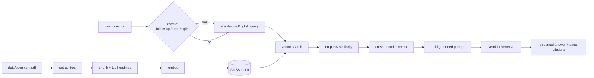

# Indian Constitution Assistant

A retrieval-augmented question answering app over a large corpus of Indian legal
text (the Constitution and allied bare Acts). Ask a question in English or Hindi;
the app answers **only** from the source document, with page citations, and
streams the response.

- **Retrieval:** `BAAI/bge-large-en-v1.5` embeddings in a FAISS index, then a
  cross-encoder reranker.
- **Generation:** Gemini on Vertex AI, grounded strictly in retrieved context.
- **UI:** Streamlit chat with native theming.

## How it works



The left half (`PDF → FAISS index`) is the one-off **ingestion pipeline**
(`ingest.py`). The right half runs per question in `app.py` /
`src/rag_pipeline.py`.

## Prerequisites

- Python 3.11+
- A Google Cloud project with the **Vertex AI API** enabled
- A service-account key (or `gcloud auth application-default login`)
- The source PDF at `data/document.pdf` (git-ignored — supply your own)

## Setup

```bash
python -m venv .venv
.venv/Scripts/activate          # Windows;  source .venv/bin/activate on macOS/Linux
pip install -r requirements.txt  # or: pip install -r requirements.lock  (exact pins)

cp .env.example .env             # then fill in GOOGLE_CLOUD_PROJECT + credentials
```

`.env` essentials:

```dotenv
GOOGLE_CLOUD_PROJECT=your-gcp-project-id
GOOGLE_CLOUD_LOCATION=global
GOOGLE_APPLICATION_CREDENTIALS=./credentials.json
GOOGLE_GENAI_USE_VERTEXAI=True
```

## Build the index

```bash
python ingest.py                 # PDF -> extracted_pages -> chunks -> embeddings -> faiss.index
python ingest.py --skip-existing # skip stages whose output already exists
python ingest.py --force         # wipe processed/ and rebuild from the PDF
```

Artifacts land in `processed/` (git-ignored), along with `ingest_manifest.json`
recording which models and settings produced the index.

## Run the app

```bash
streamlit run app.py
```

## Configuration

All optional; defaults shown. Set in `.env` or the environment.

| Variable | Default | Purpose |
|---|---|---|
| `GEMINI_MODEL` | `gemini-2.5-flash` | Vertex model id |
| `GEMINI_TEMPERATURE` | `0` | 0 = deterministic |
| `GEMINI_MAX_TOKENS` | `0` | 0 = uncapped |
| `GEMINI_THINKING_BUDGET` | `0` | 0 = thinking off; `-1` = dynamic |
| `GEMINI_TIMEOUT_MS` | `60000` | per-request timeout |
| `GEMINI_RETRY_ATTEMPTS` | `3` | retries on 429/5xx with backoff |
| `RETRIEVAL_MIN_SCORE` | `0.5` | drop chunks below this cosine similarity |
| `RERANK` | `true` | enable the cross-encoder reranker |
| `RERANK_MODEL` | `cross-encoder/ms-marco-MiniLM-L-6-v2` | reranker (fast on CPU) |
| `RERANK_CANDIDATES` | `30` | candidates fetched before reranking |
| `QUERY_REWRITE` | `auto` | `auto` \| `always` \| `never` |
| `TRACE` | off | `1` appends per-query JSON to `logs/traces.jsonl` |

## Development

```bash
pip install -r requirements-dev.txt

make test        # pytest
make lint        # ruff check + format --check
make format      # ruff check --fix + format
make hooks       # install + run pre-commit hooks
```

(No `make`? Each target's commands are in the `Makefile`; run them directly.)

CI (`.github/workflows/ci.yml`) runs lint + tests on Python 3.11 and 3.12 for
every push and PR.

## Evaluation

```bash
python eval/run_eval.py          # retrieval metrics only (offline, no GCP)
python eval/run_eval.py --llm    # also generate answers, score keyword recall
```

Scores `eval/gold.jsonl` for **hit@k**, **MRR**, off-topic **no-answer accuracy**
(and keyword recall with `--llm`). Results are written to `eval/results/`
tagged with the git SHA, so you can compare runs across changes.

## Project layout

```
app.py                 Streamlit chat UI
ingest.py              one-command ingestion pipeline
main.py                stage 1 only (PDF extraction)
src/
  config.py            paths, base dir
  logging_config.py    single Loguru setup
  pdf_loader.py        PDF -> text
  text_cleaner.py      whitespace / encoding cleanup
  chunker.py           text -> chunks, heading detection
  embedding_model.py   shared SentenceTransformer loader
  embedder.py          chunks -> embeddings (incremental, cached)
  vector_store.py      FAISS index build / load / search
  retriever.py         embed query -> search -> relevance gate -> rerank
  context_builder.py   dedupe, page-diversity, grounded prompt
  llm_service.py       Vertex AI client: generate / stream / query-rewrite
  rag_pipeline.py      orchestration
  tracing.py           optional per-query JSONL trace
eval/                  gold set + evaluation harness
tests/                 pytest suite (pure logic + mocked integration)
```

## Notes

- **CPU vs GPU.** The default reranker is chosen to be fast on CPU (~1 s / query).
  `bge-reranker-large` is more accurate but ~30× slower without a GPU — select it
  with `RERANK_MODEL` only if you have one.
- **Thinking is disabled by default.** Grounded RAG over supplied statutory text
  doesn't need chain-of-thought; disabling it is faster and reproducible. Set
  `GEMINI_THINKING_BUDGET=-1` to turn it back on.
- **Secrets.** `credentials.json` and `.env` are git-ignored; never commit them.
  Prefer `gcloud auth application-default login` for local development.
